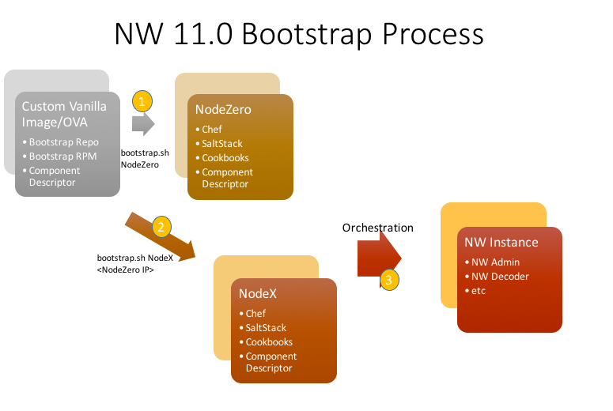

# NetWitness Bootstrap

Provides scripts and configuration that support bootstrapping a NetWitness 11.0 host.  The process starts by bootstrapping _node zero_ which is the host that acts as the Orchestration controller and Salt master.  Once node-zero has been configured, the bootstrap process must run on each additional host (called _node X_) to provision the minimal components needed for accepting orchestration/provisioning commands from node zero, which includes installing and configuring the Salt minion service.  Once the bootstrap process has completed, the Orchestration service can be invoked on node zero to accept the node X minion keys and provision additional services (i.e. component _categories_ from the [NetWitness component descriptor][1]) to other nodes (including node zero itself).



The bootstrap package (nw-bootstrap) can be installed from the bootstrap repository which is included with the ASOC Platform CentOS7 base image/OVA.  To install from the bootstrap repo, run the command `rpm -i /opt/rsa/platform/bootstrap-repo/nw-bootstrap-<version>-<release>.el7.noarch`.  For more details, please see the [bootstrap process wiki][2].

## Bootstrap Command

The bootstrap RPM (`nw-bootstrap`) installs the package content to `/opt/rsa/platform/nw-bootstrap`.  To display usage, run with `--help`:

```
cd /opt/rsa/platform/nw-bootstrap
./bootstrap.sh --help
```

```
Usage:
 bootstrap.sh command [options]

Commands:
 -z, --node-zero               Bootstrap a node-zero
 -x, --node-x                  Bootstrap a node-x

Options:
 -a, --zero-host <host>        Set node-zero host/IP address
 -i, --node-id <id>            Set custom node identity
 -l, --log-file <path>         Set log path (default: ./bootstrap.log)
 -v, --verbose                 Enable verbose output
 -g, --generate-uuid           Auto generate a random node identity
 -d, --dev-mode                Use latest available descriptor packages
 -c, --category <name>         Override for the default descriptor category
 -m, --mount-path <path>       Specify NW Yum repository mountpoint path
 -r, --repo-url <repo-url>     Specify NW Yum repository url
 -p, --property <envParam>     Optional environment attribute in the form of <name>=<value>. Can provide multiple parameters, ex: -p param1=value1 -p param2=value2

```

### Node Zero Bootstrap

Run the following command to bootstrap a node zero (admin node):
```
./bootstrap.sh -z [-i <nodeid>]
```
or
```
./bootstrap.sh --node-zero [--node-id <nodeid>]
```

For development/latest packages, include the `-d` (or `--dev-mode`) flag so that the descriptor generator does not explicitly declare any package versions in the generated `node.json`.

The `-v` (or `--verbose`) option can be used to generate debug-level output.

### Node X Bootstrap

Run the following command to bootstrap a node X:
```
./bootstrap.sh -x -a <node-zero-host-or-ip> [-i <nodeid>]
```
or
```
./bootstrap.sh --node-x --zero-host <node-zero-host-or-ip> [--node-id <nodeid>]
```

For development/latest packages, include the `-d` (or `--dev-mode`) flag so that the descriptor generator does not explicitly declare any package versions in the generated `node.json`.

The `-v` (or `--verbose`) option can be used to generate debug-level output.

**NOTE**: Before a component or category can be installed on a host, the host key must have been accepted either through the NetWitness Administration UI or via the Orchestration Client `--accept-key` command.

### Argument Details
Command/Option | Description
--- | ---
_**-z, --node-zero**_ | Bootstraps a node-zero.  Node-zero bootstrap process provisions a subset of the admin-host capabilities as well as configuring the host as SaltStack master.
_**-x, --node-x**_ | Bootstraps a node-x (any node that is not node zero).  Node-x bootstrap process provisions minimal capabilities including SaltStack minion and registering the minion with node-zero.
_**-a, --zero-host <host>**_ | Specifies the IP or hostname of node-zero (SaltStack master).  SaltStack minion utilizes this information for connecting to the SaltStack master.  This argument is optional for node-zero, required for node-x.
_**-i, --node-id <id>**_ | Optionally specify a custom ID for the minion (available on both node-zero and node-x).
_**-v, --verbose**_ | Enables verbose output for troubleshooting.
_**-g, --generate-uuid**_ | Generates a random UUID to be used as the node identity (node-id).
_**-d, --dev-mode**_ | Enables development mode which allows installation of unstable/latest package versions.  This option should not be used in production.
_**-c, --category <name>**_ | Optional override for the component descriptor category used for bootstrapping the node.  This option should not be used for a standard installation.
_**-m, --mount-path <path>**_ | Specify NW Yum repository mountpoint path.  Discovery of the mount path on hardware installs will be attempted.  This option should not be used for a standard installation.
_**-r, --repo-url <repo-url>**_ | Specify NW Yum repository url.  NW Yum repository will be defaulted.  This option allows for the repository location to be overridden.  This option should not be used for a standard installation.
_**-s, --disable-ssl-verify**_ | Used to disable the ssl verify on the NW Yum repository configuration.
_**-p, --property <envParam>**_ | Optional environment related property in the form of `<name>=<value>`. This option is used to pass environment specific attributes as needed by the bootstrap process.  Multiple parameters can be provided, ex: -p param1=value1 -p param2=value2

**NOTE**:  when running bootstrap.sh on an already bootstrapped node, the node ID will default to the existing/previously registered minion ID.

### Snapshot Repository
Snapshot RPMs can be uploaded to the snapshot Yum repository through a Jenkins job available on [asoc-platform-jenkins][1].  The purpose of the snapshot repository is to allow early "in-sprint" integration of snapshot RPMs under development, especially for dependencies on Launch core services.  For example, certain changes to the component descriptor during a sprint may require the latest snapshot version of the Orchestration Server; however, without the snapshot repository, some sprint/integration test activities cannot be completed until the Orchestration Server is officially released and published to the master repository (an event that occurs after the sprint ends).

Packages uploaded to the Platform snapshot repository are merged with the RSA NetWitness baseline repository as part of the Artifact Promotion Pipeline on [asoc-platform-jenkins][1].

Developers that have a need to create an isolated snapshot repository may do so and specify the location using bootstrap environment parameters as shown in the following example:

```
bootstrap.sh -zdi <nodeid>
    -p nw-repositories.repos.devrepo.baseurl=https://custom-repo-url
    -p nw-repositories.repos.devrepo.name=devrepo
    -p nw-repositories.repos.devrepo.sslverify=false
    -p nw-repositories.repos.devrepo.gpgcheck=false
```

## Build

Create RPM with Maven (see also corresponding Jenkins job in the ASOC Jenkins Platform folder):
```
mvn clean package
```

[1]: https://github.rsa.lab.emc.com/asoc/platform-services/tree/master/admin/nw-comp-descriptor
[2]: https://wiki.na.rsa.net/display/ASOCPLAT/NW+11.0+Bootstrap+OVA
[3]: https://asoc-platform-jenkins.rsa.lab.emc.com/